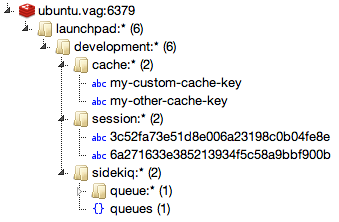

# Rails guidelines

* Put the ruby version it uses in the README.md file.

* [Use service objects for decomposing application](http://blog.codeclimate.com/blog/2012/10/17/7-ways-to-decompose-fat-activerecord-models/)
  Try not to use for example observers or filters.

* Group gems in [meaningful groups](https://gist.github.com/teamon/69a31a132ce18825f003) (not alphabetically).

* Use CoffeeScript instead of plain JavaScript.

* When making time-based statistic use the midnight of next day as upper limit.

* Split upload path into subdirectories.

  ```ruby
  # partition_uid("1234567890")
  # => "123/456/789/0"
  def partition_uid(uid, size)
      uid.gsub(/(.{#{size}})/, "\\1/")
  end
  ```

* If converting images, optimize them for web. imagemagick options: `-strip +profile "exif" -quality 80`.

* If using whenever, set absolute paths.

  ```ruby
  set :output, File.join("log", "cron.log")
  job_type :rake, "cd :path && RAILS_ENV=:environment /usr/local/bin/bundle exec rake :task :output"
  ```

* In non-SPA applications render URLs for JavaScript on server side. If you need to add them to custom JavaScript component, just print the links and iterate through them:

  ```coffee
  $('a').each (index, el) -> carousel.add(index, el)
  ```

* Use I18n kes instead of plain text in views. In order to keep the reusability, the translation strings shouldn’t contain punctuation at their end, because those belong to the very UI.

* Use attr_accessible instead of attr_protected.

* Occasionally run `rails_best_practices` command, and follow the hints.
* For more advanced apps, setup [vagrant](http://www.vagrantup.com/) along with [puppet provisioner](http://docs-v1.vagrantup.com/v1/docs/provisioners/puppet.html). The puppet file shoud be kept in `manifests/site.pp`.

* If using `strong_parameters` gem, turn `whitelist_attributes` off, otherwise leave it enabled.

* Use unicorn server in production.

* Secure secure token in public projects.

    Put it in settings.yml on production and generate once during initial setup, change when needed.

* Use `rails-timeago` gem by default. Don't render "ago" dates on server-side.

    The reason is they need to be often updated in real-time on browser side.
    For example 3 minutes after staying on page "1 minute ago" should say "4 minutes ago".

* Use `bin/setup` file as [thoughtbot describes](http://robots.thoughtbot.com/post/41439635905/bin-setup) (for example for git hooks).

* Never ever ever use natural keys in your database.

* Do not add files to `vendor/assets`. Find proper gem or create a new one in [rails-assets](https://github.com/rails-assets).

## Setup generators

```ruby
# config/application.rb
config.generators do |g|
  g.helper      false
  g.stylesheets false
  g.javascripts false
end
```

## Remember to add indexes for foreign keys

```ruby
class CreateComments < ActiveRecord::Migration
  def change
    create_table :comments do |t|
      t.integer :post_id
      t.integer :user_id

      # ...
    end

    add_index :comments, :post_id # <= this
    add_index :comments, :user_id # <= and this
  end
end
```

## Required gems and configurations for new Rails applications

```ruby
gem 'yajl-ruby'
gem 'strong_parameters'
gem 'slim-rails'
gem 'sidekiq'
gem 'devise-async'
gem 'decent_exposure'
gem 'letter_opener'
gem 'schema_plus'
gem 'coffee-rails-source-maps'

group :assets do
  gem 'rails-timeago', '~> 2.0'
end

group :development do
  gem 'letter_opener'
  gem 'rails_best_practices'
  gem 'commands'
end
```

See also [useful gems](gems.md).

## Setup proper redis namespaces



### Rails cache store

```ruby
# config/application.rb
config.cache_store = :redis_store, "redis://localhost:6379/0/app_name:#{Rails.env}:cache"
```


### Rails session store

```ruby
# config/initializers/session_store.rb
Rails.application.config.session_store :redis_store, :redis_server => { :namespace => "app_name:#{Rails.env}:session" }
```


### Rack cache

```ruby
# config/environments/production.rb
config.action_dispatch.rack_cache = {
  :metastore    => "redis://localhost:6379/0/app_name:#{Rails.env}:rack-cache:metastore",
  :entitystore  => "redis://localhost:6379/0/app_name:#{Rails.env}:rack-cache:entitystore"
}
```

### Sidekiq

```ruby
# config/initializers/sidekiq.rb
Sidekiq.configure_server do |config|
  config.redis = { :namespace => "app_name:#{Rails.env}:sidekiq" }
end

Sidekiq.configure_client do |config|
  config.redis = { :namespace => "app_name:#{Rails.env}:sidekiq" }
end
```

### Faye server

```ruby
# faye.ru
faye_server = Faye::RackAdapter.new(
  :mount => '/faye',
  :timeout => 30,
  :engine => {
    :type  => Faye::Redis, # or Faye::PersistentRedis
    :namespace => "app_name:#{ENV["RACK_ENV"]}:faye:"
  }
)
```

## Source maps

```ruby
# Do not compress assets
config.assets.compress = false

# Expands the lines which load the assets
config.assets.debug = true

# Enable sources maps
config.sass.debug_info = true
config.sass.line_comments = false
```
