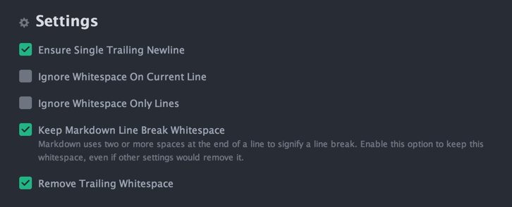

# Text Editors Guidelines

###Table of content:
1. [Obligatory settings](#obligatory-settings)
2. [Sublime Text](#sublime-text)
3. [Atom](#atom)

##Obligatory Settings
###We use 2 spaces indent and also take care about trailing whitespaces

**Ensure your editor is configured properly:**

*.vimrc*

```
if has("autocmd")
  " remove trailing white spaces
  autocmd BufWritePre * :%s/\s\+$//e
endif
```

*Neatbeans config*

```
* Tools -> Options -> Editor -> On Save > Remove Trailing Whitespace From
* Select: All lines
```
*RubyMine config*

```
Go to preferences / editor and check:

* Ensure line feed at file end on Save
* Strip trailing spaces on Save
```

*SublimeText config*

```
// Trims white space added by auto_indent when moving the caret off the line.
"ensure_newline_at_eof_on_save": true,
"tab_size": 2,
"translate_tabs_to_spaces": true,
"trim_automatic_white_space": true,
"trim_trailing_white_space_on_save": true
```

*Atom config*

* Install [Whitespace](https://atom.io/packages/whitespace) package
* To configure press `CMD + SHIFT + P` -> Open Your Config
```
'.slim.text':
  whitespace:
    removeTrailingWhitespace: true
```
For controlling last, empty line at the end of document



##Sublime Text

###Useful resources:

- [Useful keyboard shortcuts](https://gist.github.com/eteanga/1736542)
- [Unofficial Documentation](http://sublime-text-unofficial-documentation.readthedocs.org/en/latest/index.html)
- [SublimeText Screencasts](http://code.tutsplus.com/articles/perfect-workflow-in-sublime-text-free-course--net-27293)

###In order to improve your workflow you may consider using some of extensions listed below:

- [Package Control](https://sublime.wbond.net/installation) - helps in installing and managing packages. Absolulety **must have**.
- [GitGutter](https://github.com/jisaacks/GitGutter) - keeps track of `git diff` stats and shows them inline

     
- [SideBarEnhancements](https://github.com/titoBouzout/SideBarEnhancements) - adds some useful file operations available from sidebar panel

    

- [Emmet *(zencoding)*](https://github.com/sergeche/emmet-sublime) - with code shortcuts *(like `ul>li.class*3`)* helps you write code much faster. Visit [smashing magazine](http://www.smashingmagazine.com/2013/03/26/goodbye-zen-coding-hello-emmet/) for more examples.

  

- [CursorRuler](https://github.com/icylace/CursorRuler) - draws vertical ruler in cursor position. Helps in tracking indentation level.

    


- [DashDoc](https://github.com/farcaller/DashDoc) - you can look up the word under the cursor or selected text in `Dash` using `ctrl+h` shortcut. *We use Dash in Monterail, ask your PM for license details*

   

- [Gist](https://github.com/condemil/Gist) - you can create gists directly from sublime text in just few seconds.

   

##Atom

###Useful resources:

- [Documentation](https://atom.io/docs)
- [Useful keyboard shortcuts](https://bugsnag.com/blog/atom-editor-cheat-sheet)

###Terminal commands:

- `apm list` - List of installed packages
- `apm install PACKAGENAME` - Package install
- `apm uninstall PACKAGENAME` - Package uninstall
- `apm list --installed --bare > package-list.txt` - Creates list of installed packages
- `apm install --packages-file package-list.txt` - Packages installation from file

###Useful packages for FE

- [autocomplete-sass](https://atom.io/packages/autocomplete-sass) - CSS property name and value autocompletions for SASS.
- [pigments](https://atom.io/packages/pigments) - A package to display colors in project and files.

###Useful packages for BE

- [language-elixir](https://atom.io/packages/language-elixir) - Elixir language support.
- [linter-rubocop](https://atom.io/packages/linter-rubocop) - Linter based on rubocop settings.
- [rubocop-auto-correct](https://atom.io/packages/rubocop-auto-correct) - Auto-correct ruby source code by using rubocop.
- [cucumber](https://atom.io/packages/cucumber) - Cucumber support.

###Useful packages for everyone

- [tabs-to-spaces](https://atom.io/packages/tabs-to-spaces) - Provides the ability to convert between leading tabs and spaces in a document
- [todo-show](https://atom.io/packages/todo-show) - Finds all the TODOs, FIXMEs, CHANGEDs, etc. in project.
- [terminal-status](https://atom.io/packages/terminal-status) - A terminal interface and status icon.
- [minimap](https://atom.io/packages/minimap) - Displays a preview of the full source code on the right side of editor.
- [indent-guide-improved](https://atom.io/packages/indent-guide-improved) - Draws indent guide more correctly and understandably.
- [linter](https://atom.io/packages/linter), [linter-coffeescript](https://atom.io/packages/linter-coffeescript), [linter-slim](https://atom.io/packages/linter-slim), [linter-haml](https://atom.io/packages/linter-haml) - Inline helper for syntax errors and so on.
- [rulerz](https://atom.io/packages/rulerz) - A package to mark each of your cursors with a vertical ruler.
- [language-haml](https://atom.io/packages/language-haml), [language-jade](https://atom.io/packages/language-jade), [language-slim](https://atom.io/packages/language-slim) - Languages support.
- [angularjs](https://atom.io/packages/angularjs) - Adds syntax highlighting and snippets to AngularJS.
- [highlight-line](https://atom.io/packages/highlight-line) - Highlights the current line in the editor.
- [seti-icons](https://atom.io/packages/seti-icons) - The file extentions icons provided by Seti UI theme.
- [git-plus](https://atom.io/packages/git-plus) - Make commits and other git things without the terminal.
- [merge-conflicts](https://atom.io/packages/merge-conflicts) - Resolve git conflicts within Atom.
- [git-blame](https://atom.io/packages/git-blame) - Toggle git-blame annotations in the gutter of Atom editor.
- [git-history](https://atom.io/packages/git-history) - View previous versions of any file known to git.
- [circle-ci](https://atom.io/packages/circle-ci) - Adds build status from Circle CI for the current branch of the current project to the Atom UI.
- [ruby-bundler](https://atom.io/packages/ruby-bundler) - Control bundler from Atom. Run `bundle install` directly from Atom with `ALT + CMD + B`
